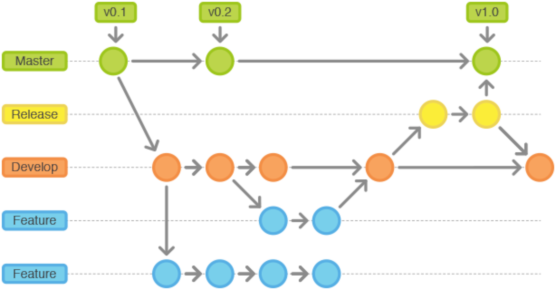

### classes[0] = "Crash course on git"

#### Laboratório de bioinformática 2018-2019


<center>Francisco Pina Martins</center>

<center>[@FPinaMartins](https://twitter.com/FPinaMartins)</center>

---

## What is git?

<ul>
<li class="fragment">Was written by Linus Trovlads</li>

<li class="fragment">Git is a *version control system*</li>
  <ul>
  <li class="fragment">What changed?</li>
  <li class="fragment">Who changed it?</li>
  <li class="fragment">When was it changed?</li>
  <li class="fragment">Why was it changed?</li>
  </ul>
</ul>

|||

## What is git?

<ul>
<li class="fragment">*Decentralized* VCS</li>
  <ul>
  <li class="fragment">Does not depend on central infrastructure</li>
  <li class="fragment">Ideal for asynchronous collaboration</li>
  <li class="fragment">Each developer has a full copy of the project</li>
  </ul>
</ul>

---

## Projects in git

<ul>
<li class="fragment">Are called *Repositories*</li>
  <ul>
  <li class="fragment">Contains all files/dirs</li>
  <li class="fragment">Including the respective edit history</li>
    <ul>
    <li class="fragment">Each change is called a *commit*</li>
      <ul>
      <li class="fragment">Linked</li>
      <li class="fragment">Organized in a tree like fashion as *branches*</li>
      </ul>


---

## Online git platforms


<ul>
<li class="fragment">A public place for code hosting</li>
<li class="fragment">Social coding!</li>
</ul>

---

## Getting (literally) started with git

```bash
mkdir my_new_repo
cd my_new_repo

git init
```

<ul>
<li class="fragment">This will initiate a new git repository</li>
<li class="fragment">Check out `ls -la` to see what it did</li>
</ul>

---

## What if the repo already exists?

```bash
git clone https://github.com/labBioinfo/workflow.git

ls -la
```

<ul>
<li class="fragment">This will clone a pre-existing repository</li>
<li class="fragment">It includes all code and commit history</li>
</ul>

---

## Ok, so I've written some code. What now?

```bash

```


<!-- .element: class="fragment" data-fragment-index="1" -->
