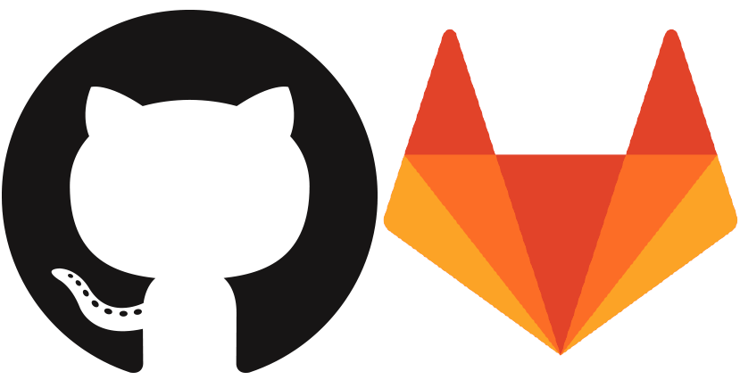

### classes[0] = "Crash course on git"

#### Laboratório de bioinformática 2018-2019


<center>Francisco Pina Martins</center>

<center>[@FPinaMartins](https://twitter.com/FPinaMartins)</center>

---

### What is git?

<ul>
<li class="fragment">Was written by Linus Trovlads</li>

<li class="fragment">Git is a *version control system*</li>
  <ul>
  <li class="fragment">What changed?</li>
  <li class="fragment">Who changed it?</li>
  <li class="fragment">When was it changed?</li>
  <li class="fragment">Why was it changed?</li>
  </ul>
</ul>

|||

### What is git?

<ul>
<li class="fragment">*Decentralized* VCS</li>
  <ul>
  <li class="fragment">Does not depend on central infrastructure</li>
  <li class="fragment">Ideal for asynchronous collaboration</li>
  <li class="fragment">Each developer has a full copy of the project</li>
  </ul>
</ul>

---

### Projects in git

<ul>
<li class="fragment">Are called *Repositories*</li>
  <ul>
  <li class="fragment">Contains all files/dirs</li>
  <li class="fragment">Including the respective edit history</li>
    <ul>
    <li class="fragment">Each change is called a *commit*</li>
      <ul>
      <li class="fragment">Linked</li>
      <li class="fragment">Organized in a tree like fashion as *branches*</li>
      </ul>


---

### Online git platforms



<ul>
<li class="fragment">A public place for code hosting</li>
<li class="fragment">Social coding!</li>
</ul>

---

### Getting (literally) started with git

```bash
mkdir my_new_repo
cd my_new_repo

git init
```

<ul>
<li class="fragment">This will initiate a new git repository</li>
<li class="fragment">Check out `ls -la` to see what it did</li>
</ul>

---

### What if the repo already exists?

```bash
git clone https://github.com/labBioinfo/workflow.git

ls -la
```

<ul>
<li class="fragment">This will clone a pre-existing repository</li>
<li class="fragment">It includes all code and commit history</li>
</ul>

---

### Ok, so I've written some code. What now?

```bash
echo "Hello git" > README.md
git add README.md
```

<ul>
<li class="fragment">This will *stage* the changes for inclusion</li>
<li class="fragment">It can be done multiple times before the next step</li>
</ul>

---

### Changes staged. Are we there yet?

```bash
git commit -m "Adds a readme file"
```

<ul>
<li class="fragment">This command will *commit* any staged changes</li>
<li class="fragment">The `-m` switch will add a commit message</li>
  <ul>
  <li class="fragment">These should summarize what the commit does</li>
  <li class="fragment">They should not end with a period</li>
  </ul>
</ul>

---

### What if I loose track of what I'm doing?

```bash
git status
git log
```

<ul>
<li class="fragment">`git status` shows:</li>
  <ul>
  <li class="fragment">Any staged changes</li>
  <li class="fragment">Any untacked files</li>
  </ul>
<li class="fragment">`git log` shows:</li>
  <ul>
  <li class="fragment">The commit history</li>
  </ul>
</ul>

---

### All this is linear! what about those "branches"?

```bash
git branch --list  # Lists all branches
git branch my_new_brunch  # Creates a new branch
git branch -D my_new_brunch  # Whoops! Deletes a typoed branch
git branch my_new_branch  # Now it's correct
# Alternatively:
git branch -m my_new_brunch my_new_branch
# "Enter" your new branch
git checkout my_new_branch
```

<ul>
<li class="fragment">`git branch` does a lot of stuff</li>
  <ul>
  <li class="fragment">By default, creating a new branch will start it as a copy of your current branch</li>
  <li class="fragment">You can also use `git branch COMMIT_HASH` to start a new branch from the specified commit</li>
  </ul>
</ul>

---

### Fine! I'll make feature development in it's own branch...

```bash
echo "A new feature" > feature.txt
echo "And so long, git!" >> README.md

git add feature.txt README.md
git commit -m "Adds a new feature file and completes the readme"

git checkout master
git merge my_new_branch
```

<ul>
<li class="fragment">These commands will merge the changes from `my_new_branch` with `master`</li>
  <ul>
  <li class="fragment">Both branches will now become even</li>
  <li class="fragment">You can now also delete `my_new_branch`</li>
  </ul>
</ul>

---

### So, where do online platforms come into play?

```bash
git remote add <name> URL
git push <name>  # Look, an error!

git push --set-upstream <name> master
# From now on you just need to perform git push from this branch!
```

<ul>
<li class="fragment">These commands will `push` your changes into a remote server</li>
<li class="fragment">Of course, this remote repository needs to be created first</li>
<li class="fragment">Conversely, `git pull` will `pull` changes from a remote repository to your local branch</li>
</ul>

---

### Now live!


