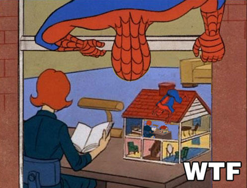

### classes[1] = "Python 201"

#### Laboratório de bioinformática 2018-2019


<center>Francisco Pina Martins</center>

<center>[@FPinaMartins](https://twitter.com/FPinaMartins)</center>

---

### Summary

<ul>
<li class="fragment">The focus of this class is advanced python programming</li>
<li class="fragment">We will focus on:</li>
  <ul>
  <li class="fragment">List comprehensions</li>
  <li class="fragment">Lambda functions</li>
  <li class="fragment">Classes (basics)</li>
  <li class="fragment">Recursion</li>
  <li class="fragment">Unit tests</li>
  </ul>
</ul>

---

### List comprehensions

<ul>
<li class="fragment">A very "pythonic" way of performing iterations</li>
<li class="fragment">But how do they work?</li>
  <ul>
  <li class="fragment">Fully contained in `[]`</li>
  <li class="fragment">An expression, followed by</li>
   <ul>
   <li class="fragment">A `for` clause, followed by</li>
    <ul>
    <li class="fragment">Zero or more `for` and `if` clauses</li>
    </ul>
   </ul>
  <li class="fragment">`[expr for item in iter if condition]`</li>
  </ul>
</ul>


|||

### List comprehensions

```python
l = [1, 2, 3, 4, 5]

exp_l = []

for i in list:
    i = i*i
    exp_l.append(i)
```

|||

### List comprehensions

```python

l = [1, 2, 3, 4, 5]
exp_l = [i*i for i in l]

```

|||

### List comprehensions

```python

text = "What's the answer to life, the universe & everything?"
answer = len([x for x in text if x not in [" ", ",", "'", "?"]])

```

|||

```python
def triple(x):
    return x * 3

l = [1, 2, 3, 4, 5]
tri_l = [triple(x) for x in l]
```

---

### List comprehension side effects

<ul>
<li class="fragment">List comprehensions can be used for their "side effects"</li>
  <ul>
  <li class="fragment">Performing some operation, but discarding the list</li>
  <li class="fragment">This is generally discouraged, but sometimes, the speed gains are worth it</li>
  </ul>
</ul>

|||

### List comprehension side effects

```python

def loop():
    accum = []
    for i in range(20):
        accum.append(i)
    return accum


def comprehension():
    accum = []
    [accum.append(i) for i in range(20)]
    return accum

```

---

### [Would you like to know more?](http://blog.cdleary.com/2010/04/efficiency-of-list-comprehensions/)

---

### Lambda functions

<ul>
<li class="fragment">AKA "Anonymous functions"</li>
<li class="fragment">Defined by the `lambda` keyword</li>
<li class="fragment">Consist of 2 parts:</li>
  <ul>
  <li class="fragment">Arguments</li>
  <li class="fragment">Expression</li>
  <li class="fragment">`lambda arguments: expression`</li>
  </ul>
<li class="fragment">Can have "`+`" arguments, but only one expression</li>
<li class="fragment">Cannot contain any statements!</li>
<li class="fragment">Frequently combined with `map()` or `filter()`</li>
</ul>


|||

### Lambda functions

```python
def triple(x):
    return x * 3

# Single argument

triple = lambda x: x * 3

# Multiple arguments

add = lambda x, y : x + y

add(2, 3)
```

|||


### Lambda functions

```python

# Combined with map()

l = [1, 2, 3, 4, 5]
tri_l = list(map(lambda x: 3 * x, l))

# Combined with filter()

odd_list = list(filter(lambda x: x % 2 != 0, l))
```

---

### [Would you like to know more?](https://medium.com/@happymishra66/lambda-map-and-filter-in-python-4935f248593)

---

### Classes & objects

<ul>
<li class="fragment">Python is an object oriented language</li>
<li class="fragment">An object is a set of vars and functions</li>
<li class="fragment">A class is a blueprint of the object</li>
  <ul>
  <li class="fragment">Objects are created from classes</li>
  <li class="fragment">"Instantiation"</li>
  </ul>
<li class="fragment">A class is defined by the keyword `class`</li>
</ul>


---

### Defining classes


|||

```python

class MyClass:
    '''A class for a class. How classy.'''
    pass

```

|||

### Defining classes

```python

class MyClass:
    "This is a class docstring"
    a = 15
    def func(self):
        print('Hello!')

print(MyClass.a)

print(MyClass.func)

print(MyClass.__doc__)
```

---

### Creating objects

<ul>
<li class="fragment">Now that we have a class, we can instantiate it</li>
  <ul>
  <li class="fragment">`new_obj = MyClass()`</li>
  <li class="fragment">`new_obj` is created from the blueprint `MyClass`</li>
  </ul>
<li class="fragment">`new_obj` proprieties (vars) and methods (functions) are now callable</li>
</ul>


|||

### Creating objects

```python
new_obj = MyClass()

print(new_obj.a)

new_obj.func()
```

---

### Modifying objects

<ul>
<li class="fragment">Once objects are created, we can now modify their proprieties!</li>
  <ul>
  <li class="fragment">`new_obj.a = 10`</li>
  </ul>
<li class="fragment">We can even create new proprieties on demand</li>
  <ul>
  <li class="fragment">`new_obj.b = "aa"`</li>
  </ul>
</ul>


|||

### Modifying objects

```python
very_new_object = MyClass()

very_new_object.b = "aa"
very_new_object.a = "10"

```

---

### Constructors

<ul>
<li class="fragment">Some special class functions begin with `__`</li>
<li class="fragment">The `__init__()` function is called whenever an object is instantiated</li>
  <ul>
  <li class="fragment">This is called a class constructor</li>
  </ul>
</ul>


|||

### Constructors

```python
class MySecondClass():
    """
    This is my second docstring
    """
    def __init__(self, m, b):
        self.m = m
        self.b = b
    def line_eq(self, x):
        y = self.m * x + self.b
        return y

one_to_one = MySecondClass(1, 3)

one_to_one.line_eq(0)
one_to_one.line_eq(1)
one_to_one.line_eq(2)

steep_line = MySecondClass(3, 0)

steep_line.line_eq(0)
steep_line.line_eq(1)
steep_line.line_eq(2)

```

---

### Class inheritance

<ul>
<li class="fragment">Classes in python can use another class as their "base"</li>
<li class="fragment">They can then be modified (or not) to suit the need</li>
  <ul>
  <li class="fragment">The original class is called the *parent* or *base* class</li>
  <li class="fragment">The new class is called the *child* or *derived* class</li>
  </ul>
<li class="fragment">This is great for code re-use</li>
</ul>


|||

### Class inheritance

```python
class BioSeq():
    """
    Generic class to store a biological sequence
    """
    def __init__(self, seq):
        self.sequence = seq

    def seq_len(self):
        self.seq_len = len(self.sequence)
        return(self.seq_len)


class DNASeq(BioSeq):
    """
    Class to store DNA sequences
    """
    def startcodon(self):
        if self.sequence.startswith("ATG"):
            print("Start codon detected")
        else:
            print("No start codon detected")


class ProteinSeq(BioSeq):
     """
    Class to store aminoacid sequences
     """
     def predict_structure(self):
         print("Predicting protein structure")

```

---

### [Would you like to know more?](https://www.programiz.com/python-programming/class)

### [And more?](https://www.digitalocean.com/community/tutorials/understanding-class-inheritance-in-python-3)

---

### Recursion

<ul>
<li class="fragment">"To understand recursion, you must understand recursion."</li>
<li class="fragment">Recursion is when a function calls itself</li>
  <ul>
 <li class="fragment">There really is not much more to it...</li>
  </ul>
</ul>



|||

```python
def listSum(ls):
    # Base condition
    if not ls:
        return 0

    # First element + result of calling `listsum` with rest of the elements
    return ls[0] + listSum(ls[1:])
 
listSum([1, 3, 4, 5, 6])
```

---

### [Would you like to know more?](https://en.wikipedia.org/wiki/Recursion)

---

### Unit tests

<ul>
<li class="fragment">Short code fragments that *test* if a code *unit* is behaving as intended</li>
<li class="fragment">Ideally independent of each other</li>
<li class="fragment">There are several frameowrks for writing python tests</li>
  <ul>
 <li class="fragment">[pytest](https://docs.pytest.org/en/latest/)</li>
 <li class="fragment">[nose](https://nose.readthedocs.io/en/latest/)</li>
 <li class="fragment">[unittest](https://docs.python.org/3/library/unittest.html)</li>
  </ul>
<li class="fragment">Unit testing minimizes bug introduction in the code</li>
<li class="fragment">Is usually associated with a *Continuous integration* (CI) service</li>
</ul>

