### classes[2] = "Phylogenetics"

#### Laboratório de bioinformática 2018-2019


<center>Francisco Pina Martins</center>

<center>[@FPinaMartins](https://twitter.com/FPinaMartins)</center>

---

### Summary

<ul>
<li class="fragment">What is phylogenetics</li>
<li class="fragment">Alignments</li>
  <ul>
  <li class="fragment">`mafft`</li>
  </ul>
<li class="fragment">Phylogenetic reconstruction methods</li>
  <ul>
  <li class="fragment">`raxml`</li>
  <li class="fragment">`mrbayes`</li>
  </ul>
</ul>

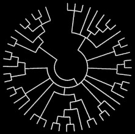

|||

### Tools of the trade

```bash
sudo apt install mrbayes raxml figtree mafft perl-tk
```

---

### What is phylogenetics?

<ul>
<li class="fragment">A set of methods to infer relations between OTUs</li>
<li class="fragment">It's used in:</li>
  <ul>
  <li class="fragment">Taxonomy</li>
  <li class="fragment">Molecular dating</li>
  <li class="fragment">Molecular evolution</li>
  <li class="fragment">Gene transfer detection</li>
  </ul>
</ul>

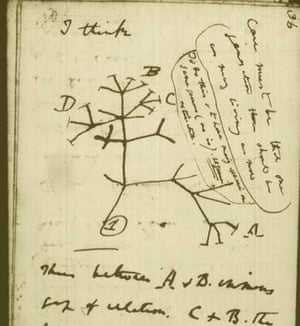

---

### What do we need for phylogenetics?

<ul>
<li class="fragment">Many different types of data:</li>
  <ul>
  <li class="fragment">Morphological traits</li>
  <li class="fragment">Behavioural traits</li>
  <li class="fragment">Molecular sequences</li>
    <ul>
    <li class="fragment">Amino Acid sequences</li>
    <li class="fragment"><span class="fragment highlight-red">DNA sequences</span></li>
    </ul>
  </ul>
</ul>

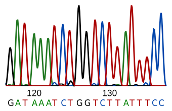

|||

### DNA sequence databases

<ul>
<li class="fragment">[NCBI (USA)](https://www.ncbi.nlm.nih.gov/)</li>
<li class="fragment">[EMBL (Europe)](https://www.embl.org/)</li>
<li class="fragment">[DDBJ (Japan)](https://www.ddbj.nig.ac.jp)</li>
  <ul>
  <li class="fragment">Replicated</li>
  <li class="fragment">Perform queries</li>
  <li class="fragment">Data repositories</li>
  </ul>
</ul>


---

### Phylogenetic trees

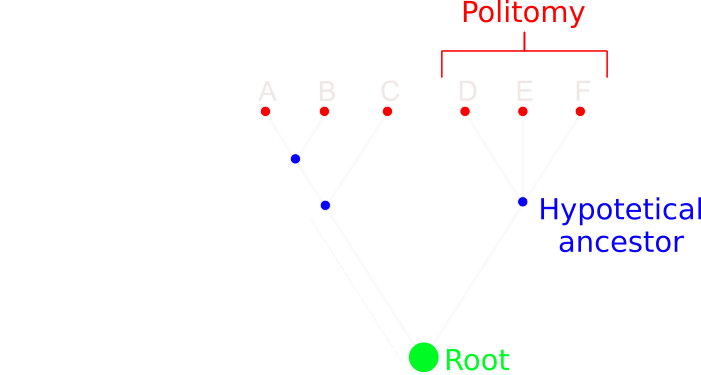

|||

### Phylogenetic trees

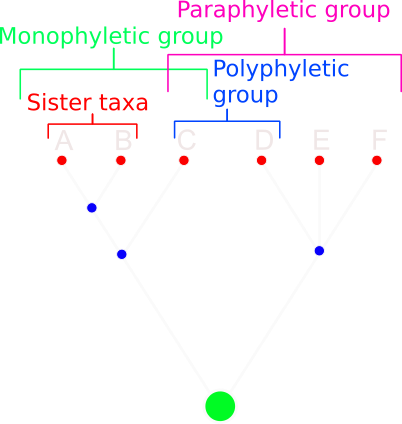

---

### From raw data to alignments

<ul>
<li class="fragment">In order to compare DNA sequences we first need to *align* them</li>
<li class="fragment">This is done to ensure any performed comparisons are valid</li>
  <ul>
  <li class="fragment">`mafft`</li>
  </ul>
</ul>

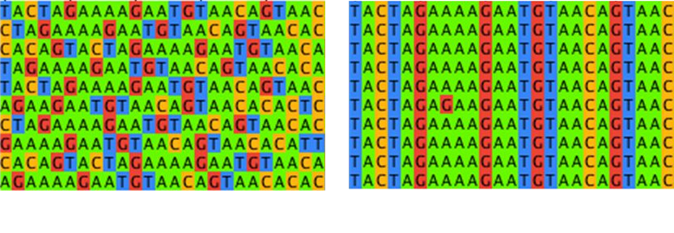

|||

### From raw data to alignments

```bash
# Prepare a dir and get a dataset
mkdir ~/phylogenetics
cd phylogenetics
wget https://raw.githubusercontent.com/labBioinfo/classes/master/docs/classes/C03_assets/testfile.fasta

# Obtain a sequence alignment viewer and use it
wget https://github.com/mpdunne/alan/archive/2.1.1.tar.gz
tar xvfz 2.1.1.tar.gz
cd alan-2.1.1
./alan ~/phylogenetics/testfile.fasta

# Align the dataset
mafft ~/phylogenetics/testfile.fasta > ~/phylogenetics/aligned_testfile.fasta

# Look at it again
./alan ~/phylogenetics/aligned_testfile.fasta
```

---

### From alignments to trees

<ul>
<li class="fragment">Once we have our aligned sequences it is necessary to choose a method to obtain a phylogenetic tree</li>
  <ul>
  <li class="fragment">Parsimony</li>
  <li class="fragment">Distance Methods</li>
  <li class="fragment">Maximum Likelihood</li>
  <li class="fragment">Bayesian inference</li>
  </ul>
</ul>

<H3 class="fragment">[Would you like to know more?](https://www.nature.com/articles/nrg3186)</H3>


---

### Parsimony methods

<ul>
<li class="fragment">Assumes the minimum possible changes</li>
<li class="fragment">It uses this premiss to perform phylogenetic reconstruction</li>
</ul>

|||

### Maximum parsimony

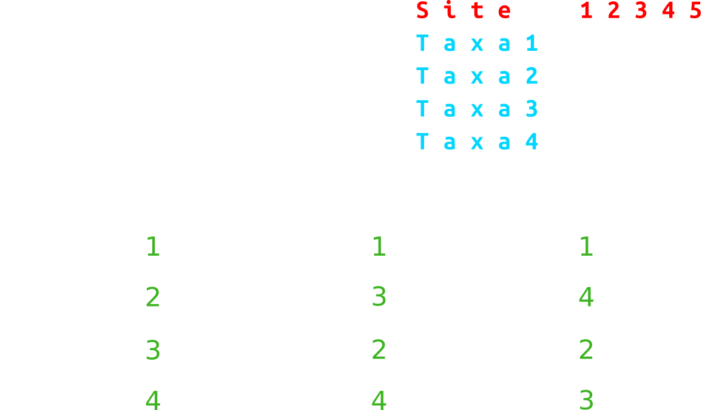

|||

### Maximum parsimony

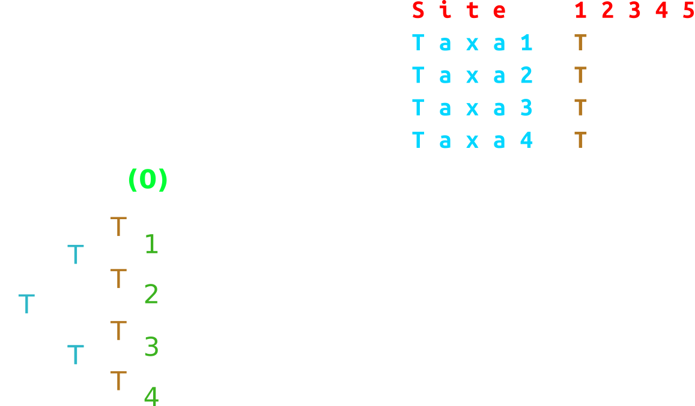

|||

### Maximum parsimony

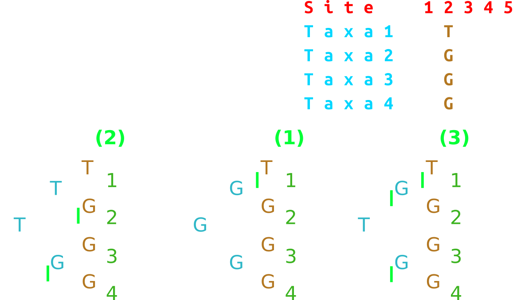

|||

### Maximum parsimony


|||

### Maximum parsimony

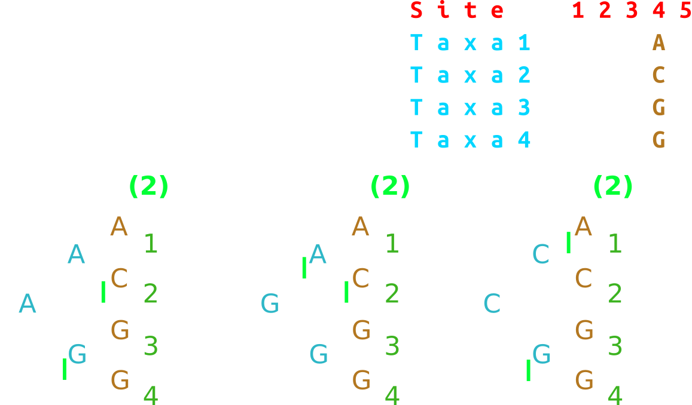

|||

### Maximum parsimony

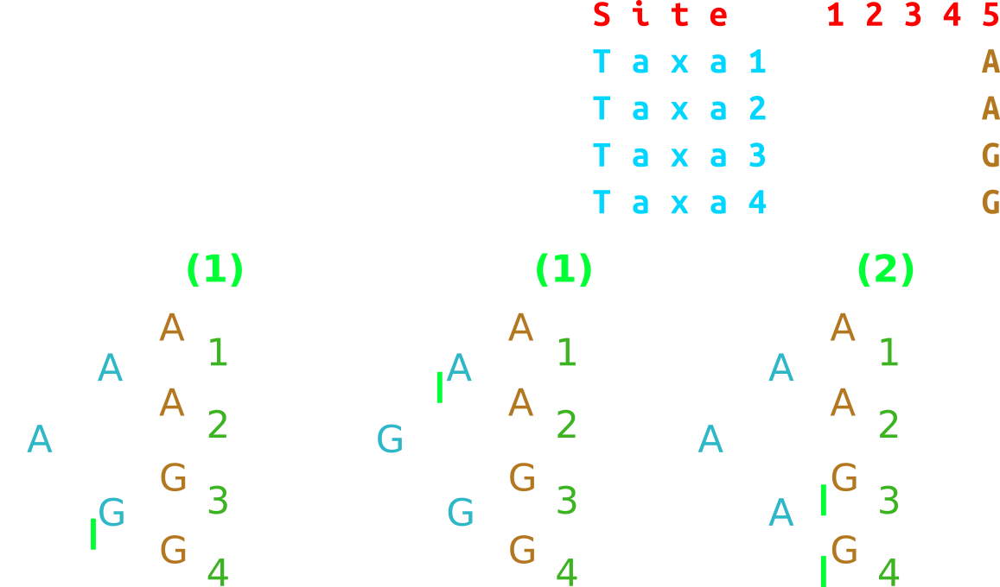

|||

### Maximum parsimony

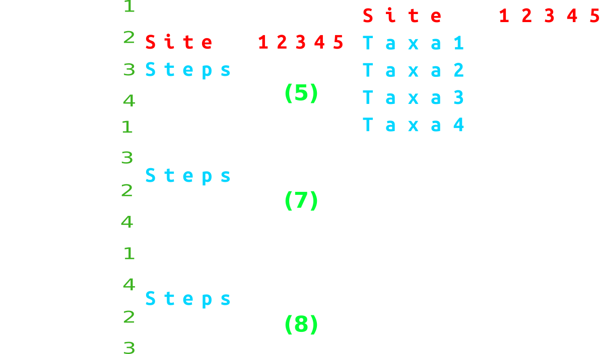

---

### Distance methods

<ul>
<li class="fragment">Simply count the number of differences between taxa</li>
  <ul>
  <li class="fragment">**Extremely** fast</li>
  <li class="fragment">**Extremely** inaccurate</li>
  <li class="fragment">Discard a lot of information</li>
  </ul>
<li class="fragment">Less used as time goes by</li>
</ul>

|||

### Distance methods

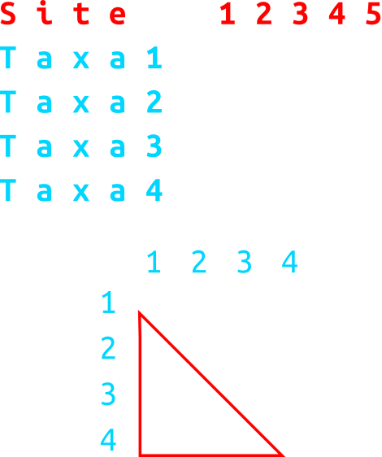

---

### Maximum Likelihood

<ul>
<li class="fragment">Based on DNA evolution models</li>
  <ul>
  <li class="fragment">Varying base frequencies</li>
  <li class="fragment">Different mutation types (and rates)</li>
  <li class="fragment">Assumes site independence</li>
  <li class="fragment">Assumes lineage independence</li>
  </ul>
<li class="fragment">Inferred trees have a *likelihood* score</li>
</ul>

|||

### Maximum Likelihood

```bash
raxmlHPC-AVX2 -f a -m GTRCAT -p 112358 -x 112358 -N 100 -s /path/to/your/aligned/file.fasta -n my_run01

figtree RAxML_bipartitions.my_run01
```

---

### Bayesian inference

<ul>
<li class="fragment">Uses bayesian statistics (duh!) to infer the best tree</li>
  <ul>
  <li class="fragment">Priors</li>
  <li class="fragment">MCMCMC</li>
  </ul>
</ul>


|||

### Bayesian inference

```bash
# Get a program to convert FASTA to NEXUS
wget https://github.com/StuntsPT/concatenator/archive/1.1.0.tar.gz
tar xvfz 1.1.0.tar.gz
cd concatenator-1.1.0
perl Concatenator.pl

# Get the run parameter settings
cd ..
wget https://raw.githubusercontent.com/labBioinfo/classes/master/docs/classes/C03_assets/mrbayes_commands.txt

# Place the run parameters in the bottom of the NEXUS file

# Run bayesian inference software
mb -i file.nex

# View the result
figtree palrun01.con.tre
```
